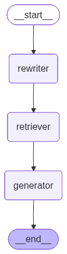
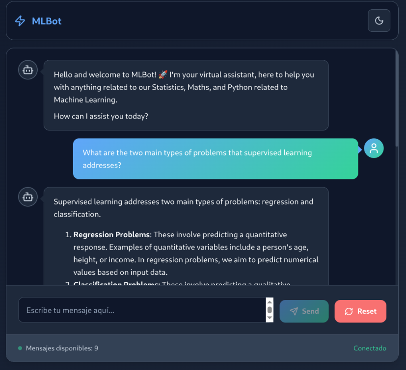
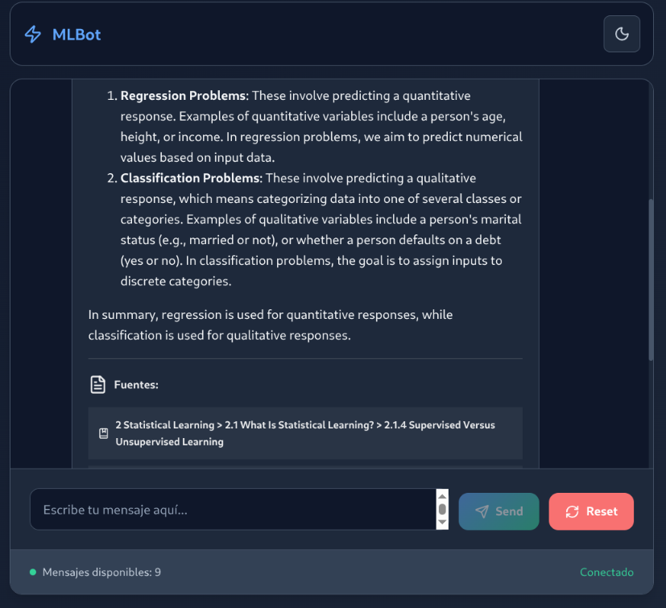
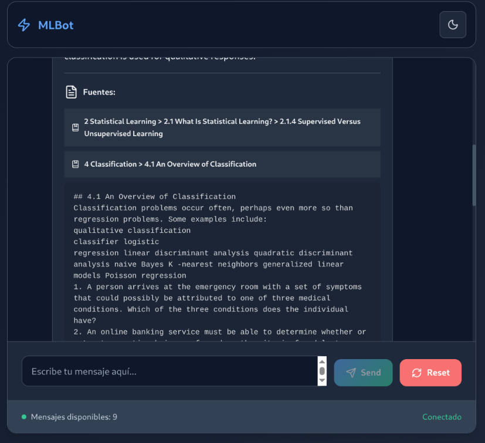
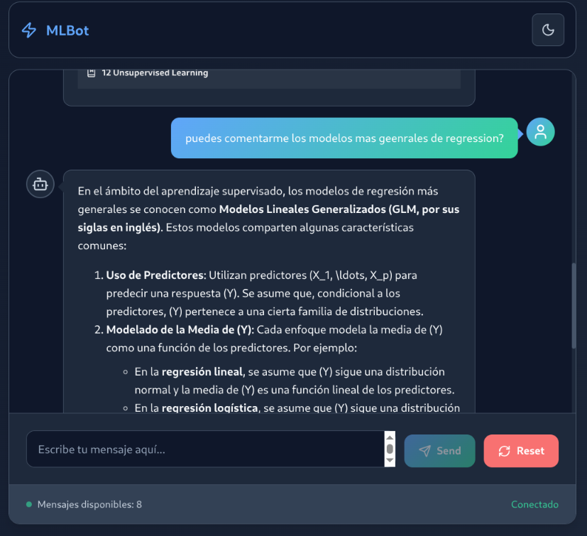
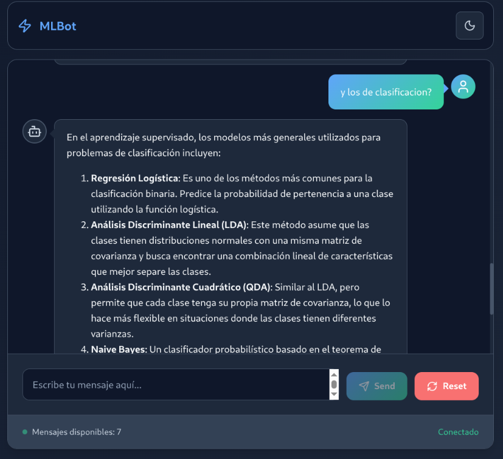
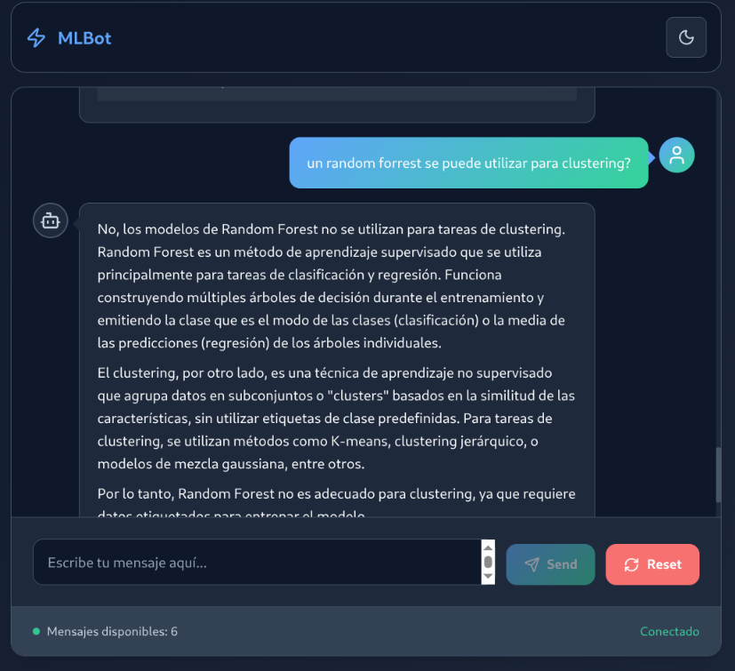
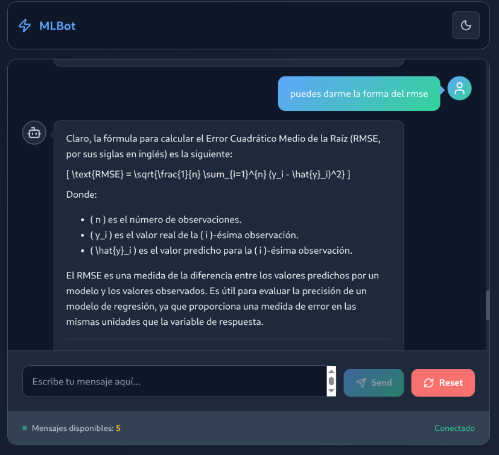

# MLBot: Asistente Experto en "An Introduction to Statistical Learning"

**MLBot** es un agente de RAG (Generación Aumentada por Recuperación) que actúa como un asistente experto en el libro "An Introduction to Statistical Learning with Applications in Python". Construido con LangGraph y la API de OpenAI, te permite resolver dudas y consultar conceptos del libro como si hablaras con un especialista.

El objetivo de este proyecto consistío en poder procesar grandes documentos, con muhca información dificil obtener de manera convencional, y luego implementar un metodo de retrieval, que mejor se adapte a la configuración del documento.

Para alcanzar estos objetivos me apoye en 3 partes fundamentales:

- Procesamiento del documento utilizando **Docling** para obtener un formato mas "estructurado" como lo es .md y la posibilidad de poder scrapear formulas matematicas con notacion LaTeX.

- Retrieval de contexto utilizando una estrategia de **Parent Child**. Esta estrategia era la mas fiel al conjunto de datos enfrentados, ya que los teoremas matematicos y/o formulas matematicas, dificilmente "quepan" en un solo chunk, por ende, al tener un .md con una estructura tan bien definida en headers, se pudo utilizar dicha estructura a la hora de pensar en "Parents" y en cada "Parent" si chunkear por tamaño fijo. El retrieval se hace por "child" chunks y lo que se utiliza como contexto, son los "parents" de dichos child chunks.

- Workflow para RAG utilizando LangGraph.

[](https://langchain-ai.github.io/langgraph/)
[](https://www.python.org/)
[](https://fastapi.tiangolo.com/)



## ✨ Características Principales

* **Respuestas Basadas en el Libro**: Todas las respuestas se generan utilizando exclusivamente el contenido del libro, asegurando fidelidad y precisión.
* **Comprensión del Contexto**: El agente puede manejar preguntas de seguimiento y repreguntas, manteniendo el hilo de la conversación.
* **Estrategia de Retrieval Avanzada**: Utiliza una arquitectura "Parent-Child" para encontrar los fragmentos más relevantes (hijos) y darles contexto completo (padres).
* **Soporte para Fórmulas Matemáticas**: Gracias al procesamiento con `docling`, el agente tiene acceso a las fórmulas en formato LaTeX del libro.
* **Evaluación Rigurosa**: La calidad del sistema ha sido medida con el framework **RAGAS**, evaluando métricas clave como fidelidad, relevancia y precisión del contexto.

---

## 🧠 ¿Cómo Funciona? (Arquitectura)

El sistema se basa en un flujo de RAG directo, orquestado con LangGraph.

### 1. Procesamiento del Documento
#### Pasar de .pdf a .md
Se utilizo mediante google colab una notebook con GPU para utilizar docling. El codigo de la notebook esta en el archivo colab_notebook.ipynb.

En esta estapa ademas del texto del .pdf se "scrapeo" la gran cantidad de formulas matemáticas que tenia el documento, con un formato LaTex, gracias a docling.

Para el procesamiento de imagenes, decidi no considerarlas, ya que en el documento mismo, cada imagen tenia bajo una descripción y explicación del contenido que reflejaba la imagen.

Luego de obtener el archivo .md, se obtiene la estructura del .pdf (table of contents) y se limpian los headers (#, ## como ###) del .md anterior, para armar una estructura de headers basandome en la table of contents. 

Aqui utilice la notebook pdftoc_to_md.ipynb para generar el documento **PDF-GenAI-Challenge_2.md** el cual fue utilizado para luego chunkear, vectorizar y almacenar en una base de datos vectorial.

#### Generacion de Chunk, Vector, Almcenambiento en Base de datos Vectorial y Estategia de Retrieval
La estrategia de procesamiento elegida es **parent-child**.

Al ser un documento técnico:

Implementé trozos pequeños (chunks) para la búsqueda: Para que la búsqueda semántica sea precisa, los fragmentos de texto (y sus embeddings) deben ser muy específicos. Si un usuario pregunta sobre regularización L1, quieres encontrar el párrafo exacto que lo define, no un capítulo entero de 20 páginas sobre regresión.

Utilicé trozos grandes (chunks) para la generación: Una vez que se encuentra ese párrafo específico, el LLM necesita más contexto para dar una buena respuesta. ¿A qué modelo se aplica? ¿Cuál era el problema que se intentaba solucionar? Este contexto se encuentra en las secciones y capítulos circundantes.

Al tener un documento en un formato .md con los headers bien definidos decidi implementar un retrieval de Parent-Child.

Para ello los chunks fueron geenrados con la siguiente lógica:
- Se realizo una limpieza de cacracteres en el .md
- Se implemento un MarkdownHeaderTextSplitter para obtener los Parent Documents.
- Se implemento un RecursiveCharacterTextSplitter para generar los Child Documents
- se utilizo Chroma como vectorstore, el cual utiliza text-embedding-3-small como modelo de embedding por default.
- El retriever utilizado fue ParentDocumentRetriever

Se utilizaron componentes de Langchain en todo este proceso.

El detalle de este proceso se ve en el archivo **retrieve_factory.py** 

#### Flujo del Agente (LangGraph)

Para la solución de este challenge se implemento un agente con un flujo de RAG directo.

El agente sigue la logica:

- Recibir Pregunta: El usuario envía una consulta.

- Rewriter: Mediante LLM se genera un "enriquericmiento" del input del usuario para reformular la pregunta y que tenga mayor significado con la historia de la conversacion.

- Retriever: El sistema siempre utiliza la pregunta, posterior salida del Rewriter, para buscar los documentos más relevantes en la base de datos vectorial.

- Generator: Los documentos encontrados se inyectan en el prompt junto con la pregunta original.
El LLM recibe el prompt aumentado y genera una respuesta basada exclusivamente en la información proporcionada.

- Retornar respuesta como chunks utilizados (si es necesario).

Este agente fue implementado con **LangGraph**, debido a la simpleza como a la flexibilidad de poder escalar la solucion a que implemente algún tipo de flujo mas complejo, o la utilización de distintas otras tools.

---

## 📊 Evaluación de Calidad (RAGAS)

Para garantizar la fiabilidad del agente, se realizó una evaluación cuantitativa utilizando el framework **RAGAS**. Se generó un dataset de preguntas y respuestas verificadas (`ground_truth`) y se midieron las siguientes métricas:

Para la evaluación del modelo se realizaron 2 tests. Buscando medir **Fidelidad**, **Precision del Contexto**, **Recuperacion** y **Relevancia** utilizando **RAGAS**

Fidelidad (Faithfulness) → faithfulness

Relevancia (Answer Relevancy) → answer_relevancy

Precisión del Contexto (Context Precision) → context_precision

Recuperación del Contexto (Context Recall) → context_recall

En este paso, primero mediante la utilizacion de un llm genere 2 listas, una enfocada a fórmulas matemáticas y otra enfocada en conceptos generales. Genere las preguntas y su ground_truth, 4 por cada capitulo, tanto en inglés como en español.

Luego utilicé el agente para obtener las respuesta y los contextos utilizados.

Con toda esta informacion, almacenada en .json implemente las evaluaciones solicitadas.

Las metricas son buenas, pero si hubo casos donde problemáticos (donde el JSON de entrada estaba mal formado o incompleto), aparece el campo error con IndexError: list index out of range, el cual afectó las metricas.

Queda pendiente para poder medir correctamente **Context Recall** agregar las "references" de las pruebas, para poder comparar el contexto recuperado con dichas referencias.

Se pueden ver estos detalles en los archivos dentro de la carpeta **tests**

---

## 🛠️ Tech Stack

* **Orquestación del Agente**: [Langgraph](https://langchain-ai.github.io/langgraph/)
* **Servidor Web**: [FastAPI](https://fastapi.tiangolo.com/)
* **Modelos de Lenguaje**: [OpenAI API](https://platform.openai.com/)
* **Base de Datos Vectorial**: [Chroma](https://github.com/chroma-core/chroma)
* **Evaluacion del Modelo**: [RAGAS](https://docs.ragas.io/en/stable/)
* **Lenguaje**: Python 3.10+

---

## ⚙️ Configuración e Instalación

Sigue estos pasos para poner en marcha el proyecto.

### Prerrequisitos

Asegúrate de tener instalado lo siguiente:
* [Python 3.10+](https://www.python.org/downloads/)

### Pasos

1.  **Clona el repositorio:**
    ```bash
    git clone [https://github.com/nachoi1000/MLBot.git](https://github.com/nachoi1000/MLBot.git)
    cd MLBot
    ```

2.  **Crea y configura tu archivo de entorno:**
    Crea un archivo llamado `.env` en la raíz del proyecto a partir de la plantilla `env.Sample`. Deberás completar las siguientes variables:
    ```env
    # Claves de APIs (ver la sección 'Obtener Claves de API')
    OPENAI_API_KEY="tu_api_key_de_openai"

    ```

3.  **Ejecuta el start file**:
    
    Dependiendo el sistema operativo ejecuta el start.sh o start.ps1.
    el mismo archivo se encargara de:
    - Levantar el entorno de python.
    - Ejecutar el app.py para ejecutar la aplicacion.

---

## 🔑 Obtener Claves de API

Para que el proyecto funcione, necesita acceso a servicios externos a través de claves de API.

### OpenAI API Key

Necesitarás una clave de OpenAI para que el agente pueda pensar y procesar el lenguaje.
1.  Ve a [platform.openai.com/api-keys](https://platform.openai.com/api-keys).
2.  Inicia sesión y crea una nueva "secret key".
3.  Copia la clave y pégala en la variable `OPENAI_API_KEY` de tu archivo `.env`.

---

## 🚀 Ejecutar el Proyecto

Los scripts de inicio construyen las imágenes de Docker y levantan los contenedores de la aplicación y la base de datos.

* En **Linux** o **macOS**:
    ```bash
    ./start.sh
    ```

* En **Windows**:
    ```powershell
    ./start.ps1
    ```

Una vez ejecutado, los servicios estarán disponibles en:

* **Aplicación MLBot**: `http://localhost:8000`

---

## 🔌 Uso de la API

FastAPI genera automáticamente una documentación interactiva para que puedas probar los endpoints fácilmente.

* **Documentación con Swagger UI**: `http://localhost:8000/docs`
* **Documentación con ReDoc**: `http://localhost:8000/redoc`

## Ejemplo de utilización

      